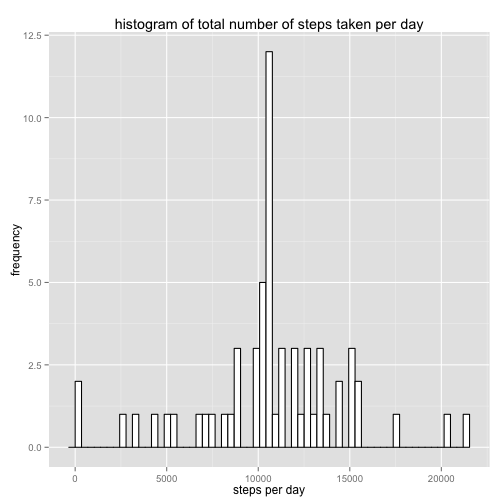

## Loading and preprocessing the data

Loading the activity data into a table and convert date column to POSIXct date class


```r
library(lubridate)

activitydata <- read.table(unz("activity.zip","activity.csv"),
                           sep = ",",
                           na.strings = "NA",
                           colClasses = c("numeric","character","numeric"),
                           header = T)

activitydata$date <- ymd(activitydata$date)
```

## What is mean total number of steps taken per day?

* Make a histogram of the total number of steps taken each day


```r
library(ggplot2)
steps_date <- aggregate(steps~date,data=activitydata,sum,na.rm=TRUE)

ggplot(steps_date,aes(x=steps_date$steps)) + geom_histogram(binwidth=(max(steps_date$steps)/nrow(steps_date))) + geom_bar(fill="white", colour="black") + ggtitle("histogram of total number of steps taken per day") + xlab("steps per day") + ylab("frequency")
```

```
## stat_bin: binwidth defaulted to range/30. Use 'binwidth = x' to adjust this.
```

 

* Calculate and report the mean and median of the total number of steps taken per day


```r
mean(steps_date$steps)
```

```
## [1] 10766.19
```

```r
median(steps_date$steps)
```

```
## [1] 10765
```

The mean of the total number of steps is $1.0766189 &times; 10<sup>4</sup>$  
The median of the total number of steps is $1.0765 &times; 10<sup>4</sup>$  

## What is the average daily activity pattern?

* Make a time series plot (i.e. type = "l") of the 5-minute interval (x-axis) and the average number of steps taken, averaged across all days (y-axis)


```r
library(ggplot2)
steps_interval<-aggregate(steps~interval,data=activitydata,mean,na.rm=TRUE)
ggplot(steps_interval,aes(x=interval, y=steps)) + geom_line()
```

 

* Which 5-minute interval, on average across all the days in the dataset, contains the maximum number of steps?


```r
steps_interval[which.max(steps_interval$steps),]$interval
```

```
## [1] 835
```
## Imputing missing values

* Calculate and report the total number of missing values in the dataset (i.e. the total number of rows with NAs)


```r
sum(is.na(activitydata$steps))
```

```
## [1] 2304
```

Number of rows missing (steps value is NA): 2304

* Devise a strategy for filling in all of the missing values in the dataset. The strategy does not need to be sophisticated. For example, you could use the mean/median for that day, or the mean for that 5-minute interval, etc.

I will lookup the mean from steps_interval data created before

```r
getMeanStepsForInterval<-function(interval){
        steps_interval[steps_interval$interval==interval,]$steps
}
```

* Create a new dataset that is equal to the original dataset but with the missing data filled in.


```r
activityNAFilled<-activitydata   # Copy data

for(i in 1:nrow(activityNAFilled)){
        # check if steps==NA for this row
        if(is.na(activityNAFilled[i,]$steps)){ 
                # query the mean for this interval and replace NA
                activityNAFilled[i,]$steps<-getMeanStepsForInterval(activityNAFilled[i,]$interval)
        }
}
```

* Make a histogram of the total number of steps taken each day and Calculate and report the mean and median total number of steps taken per day.


```r
library(ggplot2)

NAFilled_steps_date<-aggregate(steps~date,data=activityNAFilled,sum) # create aggregated data

ggplot(NAFilled_steps_date,aes(x=NAFilled_steps_date$steps)) + geom_histogram(binwidth=(max(NAFilled_steps_date$steps)/nrow(NAFilled_steps_date))) + geom_bar(fill="white", colour="black") + ggtitle("histogram of total number of steps taken per day") + xlab("steps per day") + ylab("frequency")
```

```
## stat_bin: binwidth defaulted to range/30. Use 'binwidth = x' to adjust this.
```

 

```r
mean(NAFilled_steps_date$steps)
```

```
## [1] 10766.19
```

```r
median(NAFilled_steps_date$steps)
```

```
## [1] 10766.19
```

Mean total number of steps taken per day: $1.0766189 &times; 10<sup>4</sup>$  
Median total number of steps taken per day is $1.0766189 &times; 10<sup>4</sup>$


* Do these values differ from the estimates from the first part of the assignment?

The mean value is the same because we swapped the NAs with the mean that was calculated at first.  
The median differs a little after replacing the NAs.

* What is the impact of imputing missing data on the estimates of the total daily number of steps?

The total daily number of steps will increase.

## Are there differences in activity patterns between weekdays and weekends?

* Create a new factor variable in the dataset with two levels – “weekday” and “weekend” indicating whether a given date is a weekday or weekend day.


```r
activityNAFilled$typeofday <- ifelse(as.POSIXlt(activityNAFilled$date)$wday > 5,"weekday","weekend")
activityNAFilled$typeofday=factor(activityNAFilled$typeofday,levels=c("weekday","weekend"))
```

* Make a panel plot containing a time series plot (i.e. type = "l") of the 5-minute interval (x-axis) and the average number of steps taken, averaged across all weekday days or weekend days (y-axis)


```r
library(ggplot2)
steps_interval_bytypeofday=aggregate(steps~interval+typeofday,activityNAFilled,mean)
ggplot(steps_interval_bytypeofday,aes(x=interval, y=steps, group=typeofday)) + geom_line() + facet_wrap(~typeofday, ncol=1)
```

 
